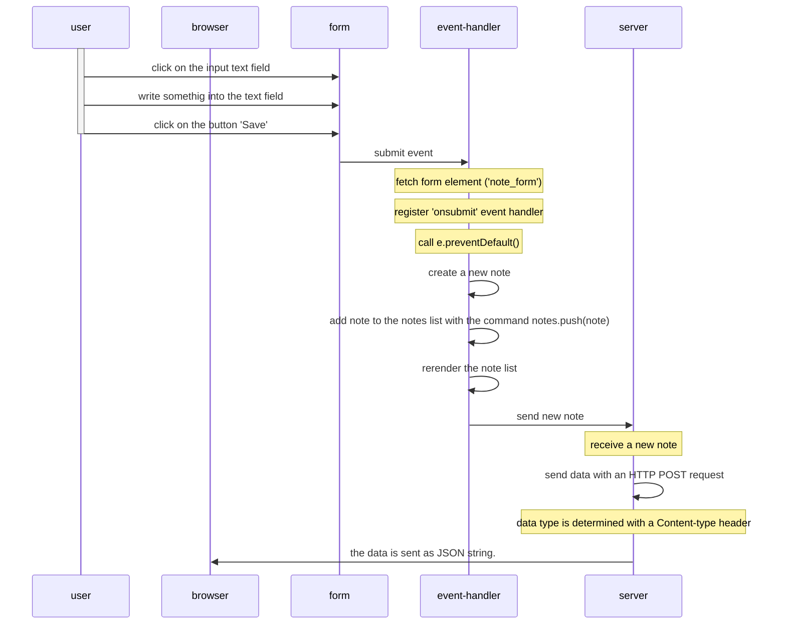

```mermaid
sequenceDiagram

    participant user
    participant browser
    participant form
    participant event-handler
    participant server

    activate user
    user ->> form: click on the input text field 
    user ->> form: write somethig into the text field
    user ->> form: click on the button 'Save'
    deactivate user
  
    form ->> event-handler: submit event
    note over event-handler: fetch form element ('note_form')
    note over event-handler: register 'onsubmit' event handler
    note over event-handler: call e.preventDefault()

    event-handler ->> event-handler: create a new note
    event-handler ->> event-handler: add note to the notes list with the command notes.push(note)
    event-handler ->> event-handler: rerender the note list
    event-handler ->> server: send new note

    note over server: receive a new note
    server ->> server: send data with an HTTP POST request
    note over server: data type is determined with a Content-type header

    server ->> browser: the data is sent as JSON string.
```